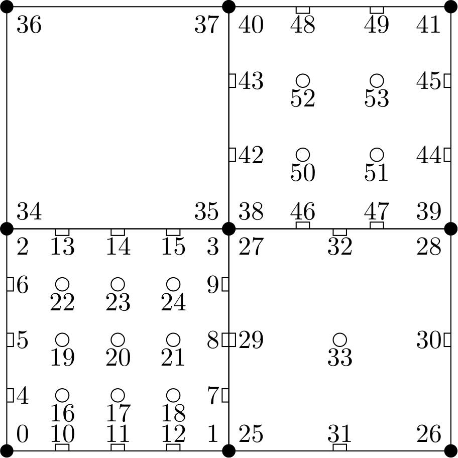

# FEM-TikZ

This tool helps displaying two-dimensional numerical grids in LaTeX using the PGFPlots package and was specifically designed for Lagrangian finite elements. Each node will be assigned with an index. We distinguish between vertex, face, and volume nodes.

It was developed to illustrate some functionalities of the [deal.II](https://github.com/dealii/dealii) project.

## Example

